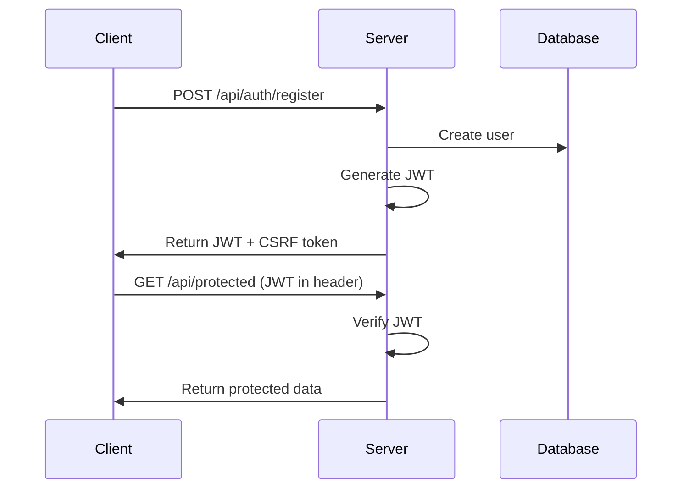

# Authentication

Create Bun Stack includes a complete authentication system with JWT tokens, secure password hashing, and CSRF protection.

## Overview

The authentication system provides:

- 🔐 **JWT-based authentication** - Stateless, scalable authentication
- 🔒 **Secure password hashing** - Using Bun's built-in Argon2id
- 🛡️ **CSRF protection** - Double-submit cookie pattern
- 👤 **User management** - Registration, login, profile updates
- 🎭 **Role-based access** - Admin and user roles
- 🚪 **Protected routes** - Frontend and backend protection

## How It Works

### Authentication Flow



### Security Architecture

1. **Password Hashing**: Argon2id with salt
2. **JWT Tokens**: Signed with HS256
3. **CSRF Protection**: Token in cookie + header
4. **Secure Headers**: XSS, clickjacking protection

## API Endpoints

### Registration

```typescript
POST /api/auth/register
Content-Type: application/json

{
  "email": "user@example.com",
  "password": "SecurePass123!",
  "name": "John Doe"
}

// Response
{
  "token": "eyJhbGciOiJIUzI1NiIs...",
  "user": {
    "id": "123",
    "email": "user@example.com",
    "name": "John Doe",
    "role": "user"
  }
}
```

### Login

```typescript
POST /api/auth/login
Content-Type: application/json

{
  "email": "user@example.com",
  "password": "SecurePass123!"
}

// Response
{
  "token": "eyJhbGciOiJIUzI1NiIs...",
  "user": {
    "id": "123",
    "email": "user@example.com",
    "name": "John Doe",
    "role": "user"
  }
}
```

### Logout

```typescript
POST /api/auth/logout
Authorization: Bearer <token>

// Response
{
  "message": "Logged out successfully"
}
```

### Get Current User

```typescript
GET /api/auth/me
Authorization: Bearer <token>

// Response
{
  "id": "123",
  "email": "user@example.com",
  "name": "John Doe",
  "role": "user"
}
```

## Frontend Usage

### useAuth Hook

```typescript
import { useAuth } from "@/app/hooks/useAuth";

export function MyComponent() {
  const { user, isLoading, login, logout, register } = useAuth();

  if (isLoading) {
    return <div>Loading...</div>;
  }

  if (!user) {
    return <div>Please log in</div>;
  }

  return (
    <div>
      <p>Welcome, {user.name}!</p>
      <button onClick={logout}>Logout</button>
    </div>
  );
}
```

### Protected Routes

```typescript
import { Navigate } from "react-router-dom";
import { useAuth } from "@/app/hooks/useAuth";

export function ProtectedRoute({ children }: { children: React.ReactNode }) {
  const { user, isLoading } = useAuth();

  if (isLoading) {
    return <div>Loading...</div>;
  }

  if (!user) {
    return <Navigate to="/login" replace />;
  }

  return <>{children}</>;
}

// Usage
<Route 
  path="/dashboard" 
  element={
    <ProtectedRoute>
      <Dashboard />
    </ProtectedRoute>
  } 
/>
```

### Login Form

```typescript
import { useState } from "react";
import { useAuth } from "@/app/hooks/useAuth";

export function LoginForm() {
  const { login } = useAuth();
  const [error, setError] = useState("");

  const handleSubmit = async (e: React.FormEvent<HTMLFormElement>) => {
    e.preventDefault();
    const formData = new FormData(e.currentTarget);
    
    try {
      await login({
        email: formData.get("email") as string,
        password: formData.get("password") as string,
      });
    } catch (err) {
      setError("Invalid email or password");
    }
  };

  return (
    <form onSubmit={handleSubmit}>
      <input type="email" name="email" required />
      <input type="password" name="password" required />
      {error && <p className="text-red-500">{error}</p>}
      <button type="submit">Login</button>
    </form>
  );
}
```

## Backend Implementation

### Password Hashing

```typescript
// src/lib/crypto.ts
export async function hashPassword(password: string): Promise<string> {
  if (!password || password.length === 0) {
    throw new Error("Password cannot be empty");
  }
  
  // Bun uses Argon2id by default
  return await Bun.password.hash(password, {
    algorithm: "argon2id",
    memoryCost: 4,
    timeCost: 3,
  });
}

export async function verifyPassword(
  password: string,
  hash: string
): Promise<boolean> {
  return await Bun.password.verify(password, hash);
}
```

### JWT Generation

```typescript
// src/lib/jwt.ts
import jwt from "jsonwebtoken";

const JWT_SECRET = process.env.JWT_SECRET!;
const JWT_EXPIRES_IN = process.env.JWT_EXPIRES_IN || "7d";

export function generateToken(payload: {
  id: string;
  email: string;
  role: string;
}): string {
  return jwt.sign(payload, JWT_SECRET, {
    expiresIn: JWT_EXPIRES_IN,
  });
}

export function verifyToken(token: string): any {
  return jwt.verify(token, JWT_SECRET);
}
```

### Auth Middleware

```typescript
// src/server/middleware/auth.ts
import { verifyToken } from "@/lib/jwt";

export function requireAuth(req: Request): Response | null {
  const token = extractToken(req);
  
  if (!token) {
    return Response.json(
      { error: "Unauthorized" },
      { status: 401 }
    );
  }
  
  try {
    const payload = verifyToken(token);
    (req as any).user = payload;
    return null; // Continue to next handler
  } catch (error) {
    return Response.json(
      { error: "Invalid token" },
      { status: 401 }
    );
  }
}

function extractToken(req: Request): string | null {
  const auth = req.headers.get("authorization");
  if (auth?.startsWith("Bearer ")) {
    return auth.slice(7);
  }
  return null;
}
```

### CSRF Protection

```typescript
// src/server/middleware/csrf.ts
export async function csrfMiddleware(req: Request): Promise<Response | null> {
  // Skip for non-mutation methods
  if (["GET", "HEAD", "OPTIONS"].includes(req.method)) {
    return null;
  }
  
  const headerToken = req.headers.get("x-csrf-token");
  const cookieToken = getCookie(req, "csrf-token");
  
  if (!headerToken || !cookieToken) {
    return Response.json(
      { error: "CSRF token missing" },
      { status: 403 }
    );
  }
  
  const isValid = await Bun.password.verify(headerToken, cookieToken);
  
  if (!isValid) {
    return Response.json(
      { error: "CSRF token mismatch" },
      { status: 403 }
    );
  }
  
  return null;
}
```

## Role-Based Access Control

### Defining Roles

```typescript
// src/lib/roles.ts
export enum Role {
  USER = "user",
  ADMIN = "admin",
}

export const permissions = {
  [Role.USER]: [
    "read:own-profile",
    "update:own-profile",
    "create:todos",
    "read:own-todos",
    "update:own-todos",
    "delete:own-todos",
  ],
  [Role.ADMIN]: [
    "read:all-users",
    "update:all-users",
    "delete:all-users",
    "read:all-todos",
    "update:all-todos",
    "delete:all-todos",
    "manage:system",
  ],
};
```

### Admin Middleware

```typescript
// src/server/middleware/auth.ts
export function requireAdmin(req: Request): Response | null {
  const authResponse = requireAuth(req);
  if (authResponse) return authResponse;
  
  const user = (req as any).user;
  if (user.role !== "admin") {
    return Response.json(
      { error: "Admin access required" },
      { status: 403 }
    );
  }
  
  return null;
}
```

### Protected Admin Routes

```typescript
// src/server/routes/admin.ts
import { requireAdmin } from "../middleware/auth";

export const admin = {
  "/users": {
    GET: [
      requireAdmin,
      async () => {
        const users = await userRepository.findAll();
        return Response.json(users);
      },
    ],
  },
  "/users/:id/role": {
    PUT: [
      requireAdmin,
      async (req: Request, { params }) => {
        const { role } = await req.json();
        const user = await userRepository.updateRole(params.id, role);
        return Response.json(user);
      },
    ],
  },
};
```

## Security Best Practices

### 1. Password Requirements

```typescript
// src/lib/validation.ts
export function validatePassword(password: string): string[] {
  const errors: string[] = [];
  
  if (password.length < 8) {
    errors.push("Password must be at least 8 characters");
  }
  
  if (!/[A-Z]/.test(password)) {
    errors.push("Password must contain an uppercase letter");
  }
  
  if (!/[a-z]/.test(password)) {
    errors.push("Password must contain a lowercase letter");
  }
  
  if (!/[0-9]/.test(password)) {
    errors.push("Password must contain a number");
  }
  
  if (!/[^A-Za-z0-9]/.test(password)) {
    errors.push("Password must contain a special character");
  }
  
  return errors;
}
```

### 2. Rate Limiting

```typescript
// Applied to auth routes
const authRateLimit = createRateLimit({
  window: 15 * 60 * 1000, // 15 minutes
  max: 5, // 5 attempts
  message: "Too many login attempts",
});
```

### 3. Token Storage

```typescript
// Store in memory, not localStorage
let token: string | null = null;

export function setToken(newToken: string) {
  token = newToken;
}

export function getToken(): string | null {
  return token;
}

export function clearToken() {
  token = null;
}
```

### 4. Secure Headers

```typescript
// Always included in responses
const securityHeaders = {
  "X-Content-Type-Options": "nosniff",
  "X-Frame-Options": "DENY",
  "X-XSS-Protection": "1; mode=block",
  "Strict-Transport-Security": "max-age=31536000",
};
```

## Session Management

### Token Refresh

```typescript
// src/app/hooks/useAuth.ts
export function useAuth() {
  const refreshToken = async () => {
    try {
      const response = await apiClient.post("/auth/refresh");
      const { token } = await response.json();
      setToken(token);
      scheduleRefresh(token);
    } catch (error) {
      logout();
    }
  };
  
  const scheduleRefresh = (token: string) => {
    const payload = jwt.decode(token) as any;
    const expiresIn = payload.exp * 1000 - Date.now();
    const refreshIn = expiresIn - 5 * 60 * 1000; // 5 min before expiry
    
    setTimeout(refreshToken, refreshIn);
  };
}
```

### Remember Me

```typescript
// Login with remember me
export async function login(credentials: LoginCredentials) {
  const response = await apiClient.post("/auth/login", {
    ...credentials,
    rememberMe: credentials.rememberMe,
  });
  
  const { token, expiresIn } = await response.json();
  
  if (credentials.rememberMe) {
    // Store in secure, httpOnly cookie
    document.cookie = `auth-token=${token}; max-age=${expiresIn}; path=/; secure; samesite=strict`;
  } else {
    // Store in memory only
    setToken(token);
  }
}
```

## Testing Authentication

```typescript
// tests/server/auth.test.ts
describe("Authentication", () => {
  test("registers new user", async () => {
    const response = await fetch("http://localhost:3001/api/auth/register", {
      method: "POST",
      headers: { "Content-Type": "application/json" },
      body: JSON.stringify({
        email: "newuser@example.com",
        password: "SecurePass123!",
        name: "New User",
      }),
    });
    
    expect(response.status).toBe(201);
    const data = await response.json();
    expect(data).toHaveProperty("token");
    expect(data.user.email).toBe("newuser@example.com");
  });
  
  test("prevents duplicate registration", async () => {
    const email = "duplicate@example.com";
    
    // First registration
    await registerUser({ email, password: "Pass123!" });
    
    // Attempt duplicate
    const response = await fetch("http://localhost:3001/api/auth/register", {
      method: "POST",
      headers: { "Content-Type": "application/json" },
      body: JSON.stringify({
        email,
        password: "Pass123!",
        name: "Duplicate",
      }),
    });
    
    expect(response.status).toBe(400);
  });
});
```

## Troubleshooting

### Common Issues

1. **"Invalid token" errors**:
   - Check JWT_SECRET is set
   - Verify token hasn't expired
   - Ensure Bearer prefix in header

2. **"CSRF token mismatch"**:
   - Check cookies are enabled
   - Verify same-origin requests
   - Include X-CSRF-Token header

3. **Password hashing slow**:
   - Adjust Argon2 parameters
   - Use async operations
   - Consider caching

### Debug Authentication

```typescript
// Enable auth debugging
export function debugAuth(req: Request) {
  console.log({
    headers: Object.fromEntries(req.headers),
    cookies: req.headers.get("cookie"),
    method: req.method,
    url: req.url,
  });
}
```

## Next Steps

- Implement [OAuth/Social Login](/docs/advanced/oauth)
- Add [Two-Factor Authentication](/docs/advanced/2fa)
- Set up [Session Management](/docs/advanced/sessions)
- Configure [API Keys](/docs/advanced/api-keys)