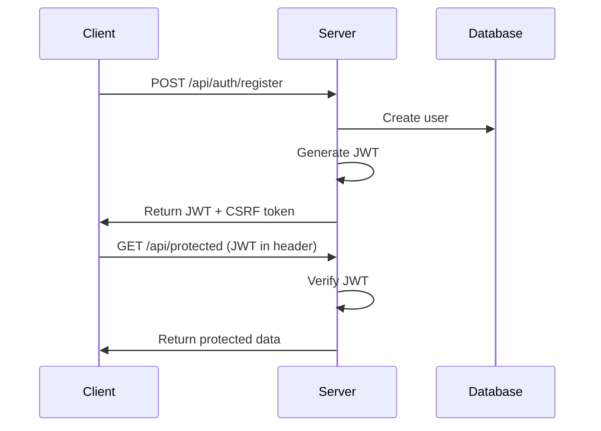

# Authentication

Create Bun Stack includes a complete authentication system with JWT tokens, secure password hashing, and CSRF protection.

## Overview

The authentication system provides:

- 🔐 **JWT-based authentication** - Stateless, scalable authentication
- 🔒 **Secure password hashing** - Using Bun's built-in password hashing
- 🛡️ **CSRF protection** - Double-submit cookie pattern
- 👤 **User management** - Registration, login, profile updates
- 🎭 **Role-based access** - Admin and user roles
- 🚪 **Protected routes** - Frontend and backend protection

## How It Works

### Authentication Flow


```mermaid
sequenceDiagram
    participant Client
    participant Server
    participant Database
    
    Client->>Server: POST /api/auth/register
    Server->>Database: Create user
    Server->>Server: Generate JWT
    Server->>Client: Return JWT + CSRF token
    
    Client->>Server: GET /api/protected (JWT in header)
    Server->>Server: Verify JWT
    Server->>Client: Return protected data
```

### Security Architecture

1. **Password Hashing**: Bun.password.hash (bcrypt)
2. **JWT Tokens**: Signed with HS256
3. **CSRF Protection**: Token in cookie + header
4. **Secure Headers**: XSS, clickjacking protection

## API Endpoints

### Registration

```typescript
POST /api/auth/register
Content-Type: application/json

{
  "email": "user@example.com",
  "password": "SecurePass123!",
  "name": "John Doe"
}

// Response
{
  "token": "eyJhbGciOiJIUzI1NiIs...",
  "csrfToken": "abc123...",
  "user": {
    "id": "123",
    "email": "user@example.com",
    "name": "John Doe",
    "role": "user"
  }
}
```

### Login

```typescript
POST /api/auth/login
Content-Type: application/json

{
  "email": "user@example.com",
  "password": "SecurePass123!"
}

// Response
{
  "token": "eyJhbGciOiJIUzI1NiIs...",
  "csrfToken": "abc123...",
  "user": {
    "id": "123",
    "email": "user@example.com",
    "name": "John Doe",
    "role": "user"
  }
}
```

### Logout

```typescript
POST /api/auth/logout
Authorization: Bearer <token>

// Response
{
  "message": "Logged out successfully"
}
```

## Frontend Usage

### useAuth Hook

```typescript
// src/app/hooks/useAuth.ts
import { useAuth } from "@/app/hooks/useAuth";

export function MyComponent() {
  const { user, loading, login, register, logout } = useAuth();

  if (loading) {
    return <div>Loading...</div>;
  }

  if (!user) {
    return <div>Please log in</div>;
  }

  return (
    <div>
      <p>Welcome, {user.name}!</p>
      <button onClick={logout}>Logout</button>
    </div>
  );
}
```

Note: `login(email, password)` and `register(name, email, password)` take positional arguments and return `{ success, user?, error? }` objects (they never throw). Example:

```typescript
const result = await login(email, password);
if (!result.success) {
  setError(result.error || "Login failed");
}
```

The hook stores the JWT token in `localStorage`.

### Protected Routes

> **Note:** The `ProtectedRoute` component below is a recommended pattern. It is not included in the generated template — create it as needed.

```typescript
import { Navigate } from "react-router-dom";
import { useAuth } from "@/app/hooks/useAuth";

export function ProtectedRoute({ children }: { children: React.ReactNode }) {
  const { user, loading } = useAuth();

  if (loading) {
    return <div>Loading...</div>;
  }

  if (!user) {
    return <Navigate to="/login" replace />;
  }

  return <>{children}</>;
}

// Usage
<Route
  path="/dashboard"
  element={
    <ProtectedRoute>
      <Dashboard />
    </ProtectedRoute>
  }
/>
```

### Login Form

> **Note:** The `LoginForm` component below is a recommended pattern. The generated template includes `LoginPage.tsx` with a similar implementation.

```typescript
import { useState } from "react";
import { useAuth } from "@/app/hooks/useAuth";

export function LoginForm() {
  const { login } = useAuth();
  const [error, setError] = useState("");

  const handleSubmit = async (e: React.FormEvent<HTMLFormElement>) => {
    e.preventDefault();
    const formData = new FormData(e.currentTarget);

    const result = await login(
      formData.get("email") as string,
      formData.get("password") as string,
    );
    if (!result.success) {
      setError(result.error || "Invalid email or password");
    }
  };

  return (
    <form onSubmit={handleSubmit}>
      <input type="email" name="email" required />
      <input type="password" name="password" required />
      {error && <p className="text-red-500">{error}</p>}
      <button type="submit">Login</button>
    </form>
  );
}
```

## Backend Implementation

### Password Hashing

```typescript
// src/lib/crypto.ts
export async function hashPassword(password: string): Promise<string> {
  if (!password || password.length === 0) {
    throw new Error("Password cannot be empty");
  }
  return await Bun.password.hash(password);
}

export async function verifyPassword(
  password: string,
  hashedPassword: string
): Promise<boolean> {
  if (!hashedPassword) return false;
  try {
    return await Bun.password.verify(password, hashedPassword);
  } catch {
    return false;
  }
}
```

### JWT Generation

```typescript
// src/lib/crypto.ts
import { createHmac } from "node:crypto";
import { env } from "../config/env";

const JWT_EXPIRY = 60 * 60 * 24; // 24 hours in seconds

export function generateToken(payload: Record<string, unknown>): string {
  const header = { alg: "HS256", typ: "JWT" };

  const encodedHeader = Buffer.from(JSON.stringify(header)).toString("base64url");
  const encodedPayload = Buffer.from(
    JSON.stringify({
      ...payload,
      iat: Math.floor(Date.now() / 1000),
      exp: Math.floor(Date.now() / 1000) + JWT_EXPIRY,
    })
  ).toString("base64url");

  const signature = createHmac("sha256", env.JWT_SECRET)
    .update(`${encodedHeader}.${encodedPayload}`)
    .digest("base64url");

  return `${encodedHeader}.${encodedPayload}.${signature}`;
}

export function verifyToken(token: string): Record<string, unknown> | null {
  try {
    const [encodedHeader, encodedPayload, signature] = token.split(".");
    if (!encodedHeader || !encodedPayload || !signature) return null;

    const testSignature = createHmac("sha256", env.JWT_SECRET)
      .update(`${encodedHeader}.${encodedPayload}`)
      .digest("base64url");

    if (signature !== testSignature) return null;

    const payload = JSON.parse(Buffer.from(encodedPayload, "base64url").toString());
    if (payload.exp && payload.exp < Math.floor(Date.now() / 1000)) return null;

    return payload;
  } catch {
    return null;
  }
}
```

### Auth Middleware

```typescript
// src/server/middleware/auth.ts
import { verifyToken } from "@/lib/crypto";
import type { AuthUser } from "@/lib/types";

declare global {
  interface Request {
    user?: AuthUser;
  }
}

export function requireAuth(req: Request): Response | null {
  const authHeader = req.headers.get("Authorization");

  if (!authHeader || !authHeader.startsWith("Bearer ")) {
    return new Response(JSON.stringify({ error: "Unauthorized" }), {
      status: 401,
      headers: { "Content-Type": "application/json" },
    });
  }

  const token = authHeader.substring(7);
  const payload = verifyToken(token);

  if (!payload || !payload.userId) {
    return new Response(JSON.stringify({ error: "Invalid token" }), {
      status: 401,
      headers: { "Content-Type": "application/json" },
    });
  }

  req.user = {
    id: payload.userId as string,
    email: payload.email as string,
    name: payload.name as string,
    role: payload.role as "user" | "admin",
  };

  return null;
}
```

### CSRF Protection

```typescript
// src/server/middleware/csrf.ts
import { randomBytes } from "node:crypto";

// WARNING: In-memory CSRF store. Tokens are lost on server restart and not shared
// across instances. For production multi-instance deployments, replace with Redis
// or database-backed storage.
const csrfTokenStore = new Map<string, { token: string; expires: number }>();

export function generateCsrfToken(): { token: string; cookie: string } {
  const token = randomBytes(32).toString("hex");
  const cookie = randomBytes(32).toString("hex");

  csrfTokenStore.set(cookie, {
    token,
    expires: Date.now() + 24 * 60 * 60 * 1000,
  });

  cleanupExpiredTokens();
  return { token, cookie };
}

export function validateCsrfToken(cookie: string | null, token: string | null): boolean {
  if (!cookie || !token) return false;
  const stored = csrfTokenStore.get(cookie);
  if (!stored) return false;
  if (stored.expires < Date.now()) {
    csrfTokenStore.delete(cookie);
    return false;
  }
  return stored.token === token;
}
```

## Role-Based Access Control

> **Note:** The examples below show recommended patterns for extending your application. These files are not included in the generated template — you'll create them as needed.

### Defining Roles

```typescript
// src/lib/roles.ts
export enum Role {
  USER = "user",
  ADMIN = "admin",
}

export const permissions = {
  [Role.USER]: [
    "read:own-profile",
    "update:own-profile",
    "create:todos",
    "read:own-todos",
    "update:own-todos",
    "delete:own-todos",
  ],
  [Role.ADMIN]: [
    "read:all-users",
    "update:all-users",
    "delete:all-users",
    "read:all-todos",
    "update:all-todos",
    "delete:all-todos",
    "manage:system",
  ],
};
```

### Admin Middleware

The `requireAdmin` function is included in the generated template alongside `requireAuth`:

```typescript
// src/server/middleware/auth.ts
export function requireAdmin(req: Request): Response | null {
  const authResponse = requireAuth(req);
  if (authResponse) return authResponse;

  if (req.user?.role !== "admin") {
    return new Response(JSON.stringify({ error: "Forbidden - Admin access required" }), {
      status: 403,
      headers: { "Content-Type": "application/json" },
    });
  }

  return null;
}
```

### Protected Admin Routes

In the generated template, admin protection is applied imperatively in `src/server/index.ts`:

```typescript
// src/server/index.ts (how admin routes are actually protected)
if (req.method === "GET" && path === "/api/users") {
  const adminCheck = requireAdmin(req);
  if (adminCheck) {
    response = adminCheck;
  } else {
    response = await handlers.GET(req);
  }
}
```

> **Note:** The route definition pattern below shows a recommended way to organize admin routes as a separate module — it is not included in the generated template.

```typescript
// src/server/routes/admin.ts (not in template — create as needed)
import { requireAdmin } from "../middleware/auth";

export async function handleAdminUsers(req: Request) {
  const adminCheck = requireAdmin(req);
  if (adminCheck) return adminCheck;
  const users = await userRepository.findAll();
  return Response.json(users);
}
```

## Security Best Practices

> **Note:** The examples below show recommended patterns for extending your application. These files are not included in the generated template — you'll create them as needed.

### 1. Password Requirements

```typescript
// src/lib/validation.ts
export function validatePassword(password: string): string[] {
  const errors: string[] = [];
  
  if (password.length < 8) {
    errors.push("Password must be at least 8 characters");
  }
  
  if (!/[A-Z]/.test(password)) {
    errors.push("Password must contain an uppercase letter");
  }
  
  if (!/[a-z]/.test(password)) {
    errors.push("Password must contain a lowercase letter");
  }
  
  if (!/[0-9]/.test(password)) {
    errors.push("Password must contain a number");
  }
  
  if (!/[^A-Za-z0-9]/.test(password)) {
    errors.push("Password must contain a special character");
  }
  
  return errors;
}
```

### 2. Rate Limiting

```typescript
// Applied to auth routes (from src/server/middleware/rate-limit.ts)
const authRateLimiter = createRateLimiter({
  windowMs: 15 * 60 * 1000, // 15 minutes
  max: 5, // 5 attempts
  message: "Too many authentication attempts, please try again later",
});
```

### 3. Token Storage

The generated template stores the JWT token in `localStorage` via the `useAuth` hook. For higher security, consider storing tokens in memory instead:

> **Note:** The in-memory token storage pattern below is a recommended security hardening — the generated template uses `localStorage`.

```typescript
// Recommended: store in memory instead of localStorage (not in template)
let token: string | null = null;

export function setToken(newToken: string) {
  token = newToken;
}

export function getToken(): string | null {
  return token;
}

export function clearToken() {
  token = null;
}
```

### 4. Secure Headers

```typescript
// Always included in responses
const securityHeaders = {
  "X-Content-Type-Options": "nosniff",
  "X-Frame-Options": "DENY",
  "X-XSS-Protection": "1; mode=block",
  "Strict-Transport-Security": "max-age=31536000",
};
```

## Session Management

> **Note:** The examples below show recommended patterns for extending your application. These files are not included in the generated template — you'll create them as needed.

### Token Refresh

```typescript
// Recommended token refresh pattern (not in template — create as needed)
export function useAuth() {
  const refreshToken = async () => {
    try {
      const response = await apiClient.post("/auth/refresh");
      const { token } = await response.json();
      setToken(token);
      scheduleRefresh(token);
    } catch (error) {
      logout();
    }
  };
  
  const scheduleRefresh = (token: string) => {
    const payload = jwt.decode(token) as any;
    const expiresIn = payload.exp * 1000 - Date.now();
    const refreshIn = expiresIn - 5 * 60 * 1000; // 5 min before expiry
    
    setTimeout(refreshToken, refreshIn);
  };
}
```

### Remember Me

```typescript
// Login with remember me
export async function login(credentials: LoginCredentials) {
  const response = await apiClient.post("/auth/login", {
    ...credentials,
    rememberMe: credentials.rememberMe,
  });
  
  const { token, expiresIn } = await response.json();
  
  if (credentials.rememberMe) {
    // Store in secure, httpOnly cookie
    document.cookie = `auth-token=${token}; max-age=${expiresIn}; path=/; secure; samesite=strict`;
  } else {
    // Store in memory only
    setToken(token);
  }
}
```

## Testing Authentication

```typescript
// tests/server/auth.test.ts
describe("Authentication", () => {
  test("registers new user", async () => {
    const response = await fetch("http://localhost:3001/api/auth/register", {
      method: "POST",
      headers: { "Content-Type": "application/json" },
      body: JSON.stringify({
        email: "newuser@example.com",
        password: "SecurePass123!",
        name: "New User",
      }),
    });
    
    expect(response.status).toBe(201);
    const data = await response.json();
    expect(data).toHaveProperty("token");
    expect(data.user.email).toBe("newuser@example.com");
  });
  
  test("prevents duplicate registration", async () => {
    const email = "duplicate@example.com";
    
    // First registration
    await registerUser({ email, password: "Pass123!" });
    
    // Attempt duplicate
    const response = await fetch("http://localhost:3001/api/auth/register", {
      method: "POST",
      headers: { "Content-Type": "application/json" },
      body: JSON.stringify({
        email,
        password: "Pass123!",
        name: "Duplicate",
      }),
    });
    
    expect(response.status).toBe(400);
  });
});
```

## Troubleshooting

### Common Issues

1. **"Invalid token" errors**:
   - Check JWT_SECRET is set
   - Verify token hasn't expired
   - Ensure Bearer prefix in header

2. **"CSRF token mismatch"**:
   - Check cookies are enabled
   - Verify same-origin requests
   - Include X-CSRF-Token header

3. **Password hashing slow**:
   - Use async operations
   - Consider caching

### Debug Authentication

```typescript
// Enable auth debugging
export function debugAuth(req: Request) {
  console.log({
    headers: Object.fromEntries(req.headers),
    cookies: req.headers.get("cookie"),
    method: req.method,
    url: req.url,
  });
}
```

## Next Steps

- Implement [OAuth/Social Login](/docs/advanced/oauth)
- Add [Two-Factor Authentication](/docs/advanced/2fa)
- Set up [Session Management](/docs/advanced/sessions)
- Configure [API Keys](/docs/advanced/api-keys)